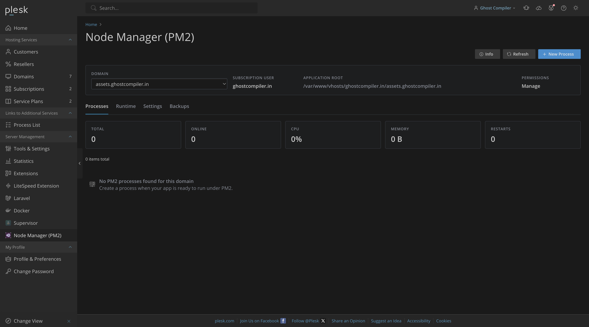

<p align="center">
  
</p>

<h1 align="center">Node Manager (PM2) for Plesk</h1>

<p align="center">
  Manage Node.js applications with PM2 from Plesk, with admin, reseller, and customer scoped access.
</p>

<p align="center">
  
  
  
  
  
  
</p>

---

## Overview

Node Manager (PM2) is a Plesk extension for managing Node.js applications with PM2 without SSH.

It is built for hosting panels where admins need a clean process manager for SSR apps, API servers, queues, websocket servers, and other long-running Node.js services while keeping customers scoped to their own subscriptions.

## Creator

- **Name:** Ghost Compiler
- **Email:** [hello@ghostcompiler.in](mailto:hello@ghostcompiler.in)
- **GitHub:** [ghostcompiler/node-manager-pm2](https://github.com/ghostcompiler/node-manager-pm2)
- **Profile:** [github.com/ghostcompiler](https://github.com/ghostcompiler)
- **Logo:** [assets.ghostcompiler.in/logo.png](https://assets.ghostcompiler.in/logo.png)

## Documentation

Full GitHub Pages documentation is available at:

**[ghostcompiler.github.io/node-manager-pm2](https://ghostcompiler.github.io/node-manager-pm2/)**

The page is maintained in [`docs/index.html`](docs/index.html) and uses the screenshots stored in [`docs/screenshots`](docs/screenshots). It covers installation, access control, process management, runtime setup, file editing, logs, deployment, ecosystem config, metrics, backups, settings, and troubleshooting.

## Screenshots

<p align="center">
  <a href="docs/screenshots/home_dark.png">
    
  </a>
</p>

Screenshot set:

- Dashboard: [dark](docs/screenshots/home_dark.png), [light](docs/screenshots/home_light.png)
- Process list: [dark](docs/screenshots/process_dark.png), [light](docs/screenshots/process_light.png)
- Create process: [dark](docs/screenshots/add_dark.png), [light](docs/screenshots/add_light.png)
- File picker: [dark](docs/screenshots/file_selection_dark.png), [light](docs/screenshots/file_selection_light.png)
- File editor drawer: [dark](docs/screenshots/edit_dark.png), [light](docs/screenshots/edit_light.png)
- Runtime setup: [dark](docs/screenshots/runtime_dark.png), [light](docs/screenshots/runtime_light.png)
- Logs drawer: [dark](docs/screenshots/log_dark.png), [light](docs/screenshots/log_light.png)
- Environment variables: [dark](docs/screenshots/env_dark.png), [light](docs/screenshots/env_light.png)
- Deployment: [dark](docs/screenshots/deploy_dark.png), [light](docs/screenshots/deploy_light.png)
- Ecosystem editor: [dark](docs/screenshots/ecosystem_dark.png), [light](docs/screenshots/ecosystem_light.png)
- Metrics: [dark](docs/screenshots/matric_dark.png), [light](docs/screenshots/matric_light.png)
- Backups: [dark](docs/screenshots/backup_dark.png), [light](docs/screenshots/backup_light.png)
- Settings: [dark](docs/screenshots/setting_dark.png), [light](docs/screenshots/setting_light.png)
- Action menu: [dark](docs/screenshots/action_dark.png), [light](docs/screenshots/action_light.png)

## Features

- PM2 process list with start, stop, restart, reload, delete, and scaling controls.
- Domain-scoped dashboard for admin, reseller, and customer users.
- Runtime detection for Node.js, npm, PM2, Git, and PM2 home.
- Admin PM2 install/update action for detected Plesk Node.js runtimes.
- Live stdout/stderr log viewer with download and clear actions.
- Environment variable manager with secret storage support.
- Git deployment actions with optional `npm install` and zero-downtime reload.
- PM2 ecosystem config editor.
- CPU and memory metrics history with graph and pagination.
- Backup and restore for extension-managed PM2 metadata.
- Plesk service-plan permissions and process limits.

## Complete Option Reference

The extension is domain scoped. All relative paths are resolved from the selected domain application root, and customer/reseller actions depend on Plesk service-plan permissions.

### Top Actions

- **Info:** Opens the extension information page with version, runtime, storage, permissions, and operational paths.
- **Refresh:** Reloads domains, process state, runtime status, metrics, and visible tab data.
- **New Process:** Opens the create-process page for the selected domain.

### Domain Context

- **Domain:** Selects the domain or subdomain workspace.
- **Subscription user:** Shows the system user that owns the selected domain.
- **Application root:** Shows the absolute document/application root used for relative process paths.
- **Permissions:** Shows the current user's effective Node Manager permission level.

### Processes Tab

- **Process row:** Opens the process detail drawer.
- **Start:** Starts a stopped PM2 process.
- **Stop:** Stops a running process.
- **Restart:** Restarts the process with PM2.
- **Reload:** Performs a PM2 reload where supported.
- **Scale:** Updates the process instance count.
- **Delete:** Removes the PM2 process and extension metadata after confirmation.

### Create Process Page

- **Name:** PM2 application name.
- **Script path:** JavaScript entry file. Browse opens the domain-scoped file picker, and selecting a file fills this field.
- **Working directory:** Process working directory. Browse opens directories inside the selected domain root.
- **Environment:** PM2 environment name, such as `production`.
- **Instances:** Number of PM2 instances to run.
- **Max restarts:** Optional restart limit passed to PM2.
- **Restart delay, ms:** Optional delay before PM2 restarts the process.
- **Git repository:** Optional deployment repository URL.
- **Git branch:** Deployment branch used by the Deploy tab.
- **Autorestart if the process exits:** Enables or disables PM2 autorestart.
- **Create and Start:** Creates the config and starts the process.

### File Picker And Editor

- **Document root:** Returns to the selected domain root.
- **Up:** Moves one directory up, but never outside the selected domain root.
- **Open:** Opens a directory inside the picker.
- **Select:** Selects a file or directory for the active form field.
- **Edit:** Opens editable files in a Plesk drawer with the CodeEditor component.
- **Save:** Writes the edited file content.
- **Close:** Closes the drawer, with confirmation when changes are unsaved.

### Runtime Tab

- **Use detected paths:** Applies detected Node.js, npm, PM2, Git, and PM2 home values to settings.
- **Install or update PM2:** Installs or updates PM2 using the detected runtime. The button is disabled while the action is running.
- **Runtime table:** Shows Node.js, npm, PM2, and Git status, detected version, and resolved path.
- **PM2 home:** Shows the PM2 home directory used for managed processes.

### Settings Tab

- **Node binary path:** Absolute path to `node`.
- **npm binary path:** Absolute path to `npm`.
- **PM2 binary path:** Absolute path to `pm2`.
- **Git binary path:** Absolute path to `git`.
- **PM2 home:** Directory used by PM2 for process state.
- **Extra PATH:** Additional PATH entries for PM2 commands.
- **Polling interval:** Process and metrics refresh interval.
- **Max log bytes:** Maximum bytes read from stdout/stderr in the log drawer.
- **Metrics retention days:** How long sampled CPU and memory metrics are kept.
- **Deployment timeout:** Maximum deployment command runtime.
- **Save Settings:** Persists settings for the extension.

### Backups Tab

- **Create Backup:** Exports extension-managed metadata and settings.
- **Restore:** Imports a previous backup.
- **Delete:** Removes a backup archive.
- **Backup list:** Shows backup name, creation time, size, and available actions.

### Process Detail Drawer

- **Logs:** View stdout or stderr, refresh, clear by truncating the log file, and download logs.
- **Env:** Add, edit, save, mark secret, or delete environment variables.
- **Deploy:** Pull from Git, optionally run `npm install`, choose production dependencies, and reload after deployment.
- **Ecosystem:** Edit the PM2 ecosystem configuration, save it, or save and start the process.
- **Metrics:** View CPU and memory chart data plus the latest five metric samples by default.

## Requirements

- Plesk Obsidian 18.0.34 or newer on Linux.
- Physical hosting enabled for domains that will run Node.js apps.
- Plesk Node.js extension or another Node.js/npm runtime available on the server.
- SQLite PDO extension available to the Plesk PHP runtime.
- Git installed for deployment features.
- PM2 installed globally or installed from the extension runtime page by an administrator.

## Installation

Install the latest runner-built package directly from GitHub:

```sh
plesk bin extension --install-url https://github.com/ghostcompiler/node-manager-pm2/releases/download/latest/node-manager-pm2.zip
```

This URL points to the rolling `latest` release asset. The **Package Latest** workflow rebuilds `node-manager-pm2.zip` from the current `main` branch on every push and whenever it is started manually, so the install command stays stable and does not depend on a hardcoded version number.

Pinned version installs are also available after publishing a versioned release:

```sh
plesk bin extension --install-url https://github.com/ghostcompiler/node-manager-pm2/releases/download/v1.0.0/node-manager-pm2-1.0.0.zip
```

Build the extension ZIP locally:

```sh
./packaging/build.sh
```

Install the locally built archive through Plesk CLI:

```sh
plesk bin extension --install node-manager-pm2-1.0.0.zip
```

Or install through Plesk UI:

1. Open **Plesk Admin**.
2. Go to **Extensions**.
3. Click **Upload Extension**.
4. Upload `node-manager-pm2-1.0.0.zip`.
5. Open **Node Manager (PM2)** from the Plesk sidebar or a domain page.

## Testing

Run the same local checks used by the CI runner:

```sh
npm ci --ignore-scripts --legacy-peer-deps
npm run build
find plib htdocs -type f \( -name '*.php' -o -name '*.phtml' \) -print0 | xargs -0 -n1 php -l
xmllint --noout meta.xml
node -e "JSON.parse(require('fs').readFileSync('packaging/manifest.json', 'utf8'))"
sh -n packaging/build.sh
sh -n sbin/pm2-helper
./packaging/build.sh
zip -T node-manager-pm2-1.0.0.zip
```

GitHub Actions runners are included:

- **CI** runs on every branch push, pull request, and manual dispatch. It validates PHP, JavaScript, documentation screenshots, metadata, shell scripts, builds the extension, tests the ZIP, and uploads package artifacts.
- **Package Latest** runs on `main` and manual dispatch. It builds and publishes the stable `node-manager-pm2.zip` asset to the rolling `latest` GitHub release.
- **Release** runs on `v<version>` tags and manual dispatch. It verifies the tag matches `meta.xml`, builds `node-manager-pm2-<version>.zip`, and publishes the versioned release.
- **Pages** runs when documentation changes on `main` and manual dispatch. It validates `docs/index.html` screenshot references and deploys the `docs/` folder to GitHub Pages.

## First Run

1. Open the affected service plan or subscription.
2. Enable **Node Manager (PM2) access**.
3. Enable the needed action permissions: control, logs, and manage.
4. Set **Maximum PM2 applications** to a non-zero value for subscriptions that can create processes.
5. Sync existing subscriptions if Plesk marks them as customized or out of sync.
6. Open **Node Manager (PM2)** as admin, reseller, or customer.
7. Review the Runtime tab and install PM2 if needed.

## Example SSR Process

For a subdomain such as `assets.example.com` where the app root is:

```text
/var/www/vhosts/example.com/assets.example.com
```

Use:

```text
Name: assets-ssr
Script path: server.js
Working directory: .
Environment: production
Instances: 1
Autorestart: enabled
```

The extension resolves relative paths from the selected domain application root, so `server.js` becomes:

```text
/var/www/vhosts/example.com/assets.example.com/server.js
```

## Troubleshooting Logs

When the UI reports a 500 error, check:

```sh
tail -n 200 /var/log/plesk/panel.log
tail -n 200 /var/log/sw-cp-server/error_log
tail -n 200 /usr/local/psa/var/modules/node-manager-pm2/logs/node-manager-pm2.log
```

On some Plesk builds, the panel log is stored at:

```sh
tail -n 200 /usr/local/psa/admin/logs/panel.log
```

## Security Model

- Admins can view and manage all enabled domains.
- Resellers and customers only see domains where Node Manager access is enabled.
- Customer and reseller access is controlled by Plesk service plan permissions.
- Process script and working-directory paths are locked inside the selected domain application root.
- PM2 commands run under the selected domain system user when Plesk `pm_ApiCli::callDomain()` is available.
- The extension stores PM2 metadata and secrets in SQLite under the Plesk module `var` directory.

## Development Notes

- PHP classes live in `plib/library/NodeManagerPm2`.
- Authenticated UI and JSON APIs are served by `plib/controllers/IndexController.php`.
- The Plesk React UI Library bundle lives in `frontend/` and is built to
  `htdocs/dist/node-manager-pm2-ui.js`.
- The public deployment webhook lives at `htdocs/public/webhook.php`.
- Persistent state is stored in SQLite under the module `var` directory.
- Package configuration lives in `packaging/manifest.json` and `packaging/build.sh`.

See `docs/INSTALL.md`, `docs/SECURITY.md`, `docs/API.md`, and `docs/ARCHITECTURE.md` for operational details.


## Development Environment

Built using **ServBay**

<p align="left">
  
</p>

- Mac M4 Tested
- macOS Apple Silicon
- Powered by ServBay

---